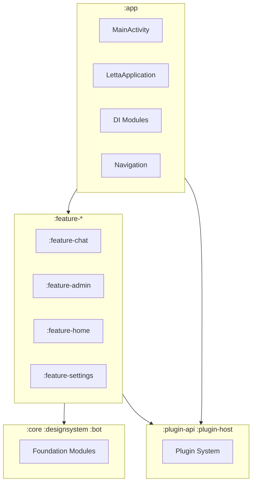
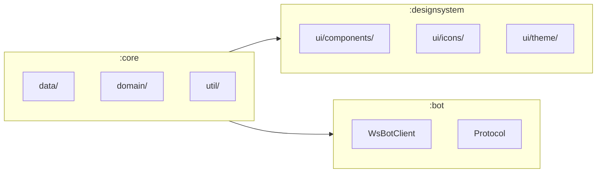
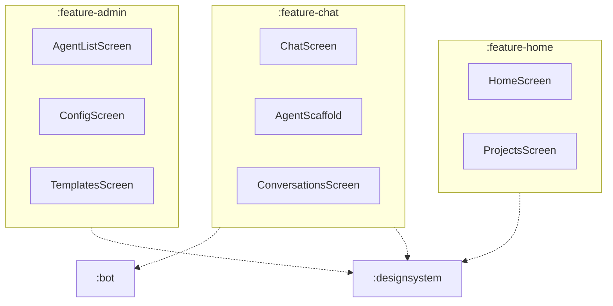
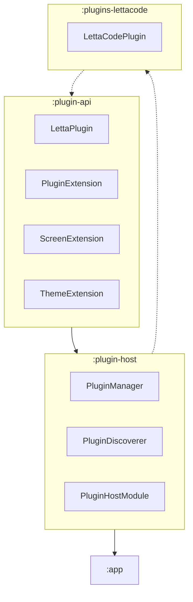
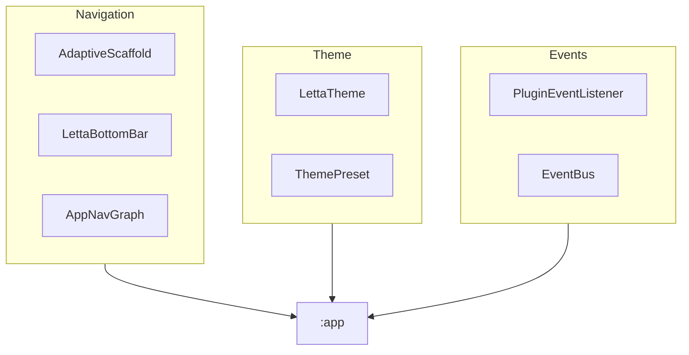
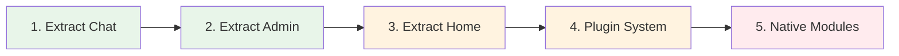
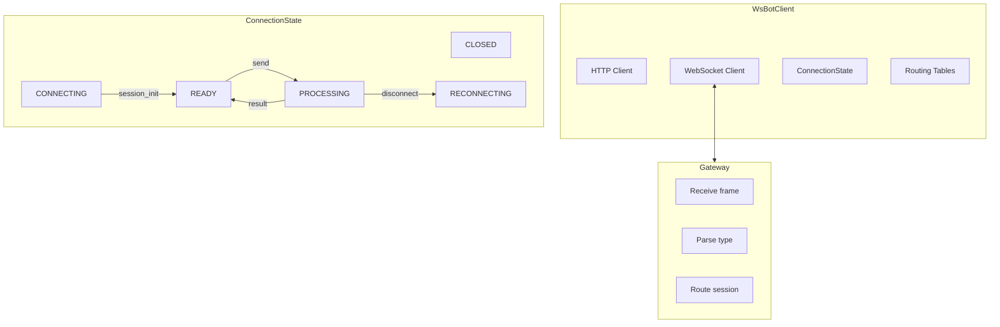
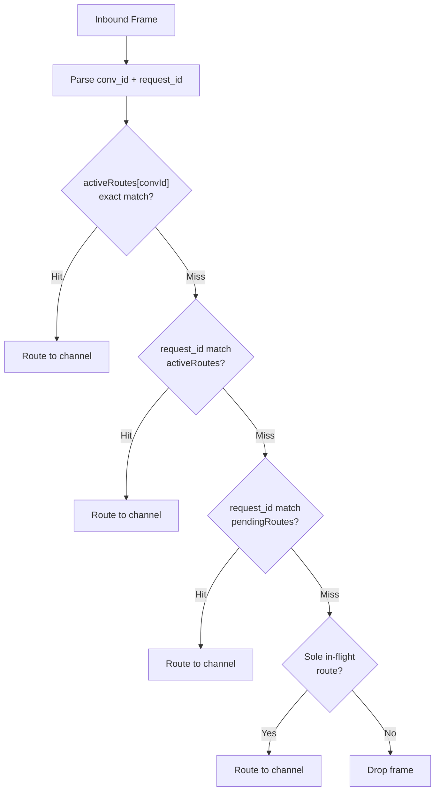
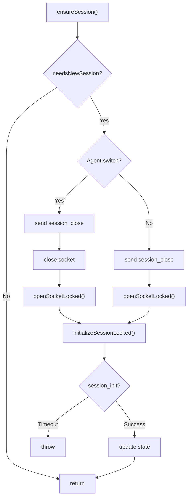
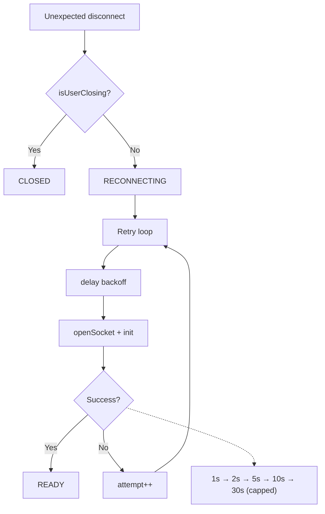

# Letta Mobile Architecture Diagrams

## 1. Overall Module Structure

## 2. Foundation Modules

## 3. Feature Modules

## 4. Plugin System

## 5. Extension Points

## 6. Migration Phases

## 7. WebSocket Connection Flow

## 8. Inbound Demux

## 9. Session Initiation

## 10. Reconnection Logic

