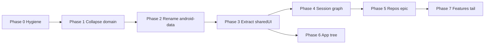

# Epic: KMP project structure migration

**Status:** in progress (Phase 0–3c merged; Phase 4a–4b on `refactor/kmp-structure-phase-4`)  
**Priority:** P2  
**Labels:** `kmp`, `architecture`, `migration`  
**Related docs:**

- [kmp-extraction-current-state.md](kmp-extraction-current-state.md) — what is already landed in `:sharedLogic`
- [kmp-best-practices-migration-plan.md](kmp-best-practices-migration-plan.md) — long-form JetBrains/Cash App guidance (bead `letta-mobile-45eyc`)
- [../architecture-review.md](../architecture-review.md) — session graph / runtime boundary context

**Beads import:** When Dolt is reachable, run the commands in [Beads import commands](#beads-import-commands) below (or attach this file as the epic description).

---

## Problem

The repo started as Android-only and now ships **Android + Compose Desktop + wasm probes** from one codebase, but the **Gradle/IDE module graph still reads Android-first**:

| Symptom | Where |
|---|---|
| Portable logic lives in one monolith | `:sharedLogic` (commonMain + custom UI source sets) |
| “Domain” depends on shared logic (inverted) | `:core:domain` → `api(project(":sharedLogic"))` |
| Android session/Room/Hilt mixed with “core” naming | `:core:android-data` (renamed from `:core:data` in Phase 2) |
| Shared Compose UI inside logic module | `sharedLogic/composeUi`, `sharedLogic/jvmAndAndroid` |
| Desktop re-implements bindings | `desktop/data/*` vs `core/android-data/session/*` |
| IDE/repo layout confusion | Gradle root is `android-compose/`; IntelliJ opens repo root; orphan `shared-ui/` build dir |
| Runnable apps not grouped | `app/`, `desktop/`, `web/` siblings under `android-compose/` |

This is **migration in progress**, not a greenfield mistake — but it needs a sequenced plan so PRs stay small and CI stays green.

---

## Target end state

```text
android-compose/
  sharedLogic/          KMP — contracts, transport, timeline, reducers, repo impls
  sharedUI/             KMP — Compose Multiplatform UI (Android + Desktop + wasm)
  core/
    ids/                KMP foundation (keep)
    runtime/            KMP foundation (keep)
    android-data/       Android-only — Room, DataStore, Hilt, SessionManager wiring
  apps/                 (or keep paths; see Phase 6)
    android/            Application — manifest, DI, platform services
    desktop/            JVM runnable — windowing, installer, touch shim
    web/                  wasmJs runnable
  designsystem/         Android Jetpack Compose until migrated into sharedUI
  feature-*/             Android presentation shells (ViewModels, Hilt, nav)
```

**North-star dependency rule:**

```text
apps → feature-* / designsystem → sharedUI → sharedLogic → core:ids, core:runtime
apps → core:android-data          (Android only)
sharedLogic must NOT depend on :app, :desktop, :core:android-data, :designsystem, :feature-*
```

---

## CI gate (every phase PR)

```bash
cd android-compose
./gradlew --no-daemon :sharedLogic:allTests :desktop:test
./gradlew --no-daemon :app:compileRootDebugKotlin :app:testRootDebugUnitTest
./gradlew --no-daemon :architecture-tests:test    # required after Phase 0
```

---

## Phase overview



| Phase | ID (local) | Title | Est. |
|---|---|---|---|
| 0 | `kmp-phase-0` | Hygiene & guardrails | 1–2 PRs |
| 1 | `kmp-phase-1` | Collapse `:core:domain` | 1 PR |
| 2 | `kmp-phase-2` | Rename `:core:data` → `:core:android-data` | 1 PR |
| 3 | `kmp-phase-3` | Extract `:sharedUI` from `:sharedLogic` | 2–4 PRs |
| 4 | `kmp-phase-4` | Session graph — one contract, two bindings | 2–3 PRs |
| 5 | `kmp-phase-5` | Repository consolidation (ongoing epic) | multi-PR |
| 6 | `kmp-phase-6` | Runnable app tree | 1–2 PRs |
| 7 | `kmp-phase-7` | Feature & designsystem long tail | ongoing |

---

## Phase 0 — Hygiene & guardrails

**Local ID:** `kmp-phase-0`  
**Depends on:** —  
**Blocks:** Phase 1+

### Scope

- Treat **`android-compose/`** as the primary IntelliJ/Gradle project root for daily KMP work.
- Sync **`web`** into IDE Gradle modules; remove or gitignore orphan **`shared-ui/`** (artifacts only, not in `settings.gradle.kts`).
- Add **`docs/architecture/kmp-module-map.md`** — current vs target module graph (one page).
- Extend **`architecture-tests`**: `:sharedLogic` must not depend on `:app`, `:core:android-data`, `:designsystem`, `:feature-*`, `:desktop`.
- Begin **`gradle/libs.versions.toml`** (desktop already notes absence of version catalog).

### Acceptance

- [ ] No ghost modules confusing IDE sync
- [ ] Architecture test fails if sharedLogic takes an Android-app dependency
- [ ] Required CI green
- [ ] `kmp-module-map.md` merged

### Risk

Low — no production logic moves.

---

## Phase 1 — Collapse `:core:domain`

**Local ID:** `kmp-phase-1`  
**Depends on:** Phase 0 (recommended)  
**Blocks:** Phase 2

### Scope

`:core:domain` is ~10 JVM files and **`api(project(":sharedLogic"))`** — inverted. Repository APIs already live in `sharedLogic/commonMain`.

- Merge remaining types into `sharedLogic/commonMain` (dedupe with existing `repository/api/*`).
- Update `:core:android-data` to depend on `:sharedLogic` only.
- Remove `:core:domain` from `settings.gradle.kts`, kover, architecture-tests.
- Point ArchUnit bytecode scan at `sharedLogic` jvmMain instead of `core/domain`.

### Acceptance

- [ ] No module references `:core:domain`
- [ ] No duplicate repository interface definitions
- [ ] CI green

### Risk

Low.

---

## Phase 2 — Rename `:core:data` → `:core:android-data`

**Local ID:** `kmp-phase-2`  
**Depends on:** Phase 1  
**Blocks:** Phase 3

### Scope

Mechanical Gradle rename. Charter the module:

> Android persistence + DI + session wiring only. No new portable logic.

Contains: Room, Hilt, `SessionManager`, `SessionGraphAssembler`, `SessionScoped*`, Android Ktor (OkHttp), Android repo impls.

- Rename module in `settings.gradle.kts` and all `project(":core:data")` refs.
- Update CI scripts (`changed-gradle-modules.sh`, etc.).
- Add short `core/android-data/README.md`.

Package rename (`com.letta.mobile.data` paths) is **optional** — defer to avoid churn.

### Acceptance

- [x] Gradle project name reflects Android-only role
- [ ] CI green
- [x] README states “no portable logic here”

### Risk

Low–medium (wide mechanical grep).

---

## Phase 3 — Extract `:sharedUI`

**Local ID:** `kmp-phase-3`  
**Depends on:** Phase 2  
**Blocks:** Phase 4, Phase 6

### Scope

Move shared Compose out of `:sharedLogic` custom source sets:

| From | To |
|---|---|
| `sharedLogic/composeUi` | `:sharedUI` |
| `sharedLogic/jvmAndAndroid` (UI) | `:sharedUI` |

Steps (separate PRs):

1. **3a** — Create `:sharedUI` KMP module (android + jvm; wasm later).
2. **3b** — Move sources; `sharedUI` depends on `sharedLogic`.
3. **3c** — Trim Compose deps from `sharedLogic` where no longer needed.
4. **3d** — Wire `:app`, `:desktop`, `:web` to `:sharedUI`.

**Keep in sharedLogic:** projection models, `@Stable` UI state types used by non-Compose code, chat render *data* (not composables).

### Acceptance

- [ ] A2UI renderer + shared chat markdown/bubbles still work on Android and Desktop
- [ ] `:sharedLogic:allTests` + `:desktop:test` green
- [ ] New UI composables default to `:sharedUI`
- [x] **3a:** `:sharedUI` module included, depends on `:sharedLogic`, android+jvm targets only
- [x] **3b:** UI sources moved from `composeUi` / `jvmAndAndroid` UI packages; consumers wired
- [x] **3c:** Compose UI plugins/toolkit removed from `:sharedLogic` (runtime-only retained)

### Risk

Medium — Gradle source-set surgery.

**Note:** [Windows Chat UI Decision](windows-chat-ui-decision.md) chose platform desktop shells first; this phase **does not** force feature parity — it fixes module boundaries so shells can shrink over time.

---

## Phase 4 — Session graph unification

**Local ID:** `kmp-phase-4`  
**Depends on:** Phase 3  
**Blocks:** Phase 5

### Scope

**Already shared:** `SessionRepositoryGraph`, `SessionRepositoryGraphFactory`, `SessionRepositoryGraphProvider`, `DefaultSessionRepositoryGraphProvider`, plus Phase 4b helpers: `SessionBackendBinding` / `sessionBackendBinding`, `remoteLettaBackendDescriptor`, `BackendConnectionKey`.

**Still split:**

- Android: `SessionManager` (auto-rebuild on config), `SessionGraphAssembler`, `SessionScoped*` in `core:android-data`
- Desktop: `DesktopSessionGraph`, `DesktopSessionGraphFactory`, `DesktopRepositoryAdapters`

**Slices:**

- **4a:** shared `DefaultSessionRepositoryGraphProvider` — Android `SessionManager` and desktop `DesktopSessionGraphProvider` extend it.
- **4b (this PR):** shared session backend selection + remote descriptor + connection key; Android transport factory is mode-first (LOCAL wins over leftover `iroh://`); both hosts call the same helpers.
- **4c:** shrink desktop “unavailable repository” stubs where sharedLogic already has HTTP/Iroh/App Server impls.

### Acceptance

- [x] Android and Desktop obtain graphs through the same shared *provider* contract (`DefaultSessionRepositoryGraphProvider`)
- [x] Platform-neutral assembly *selection* lives in sharedLogic (descriptor + binding + connection key)
- [ ] Desktop “unavailable repository” surface shrinks for iroh/App Server paths
- [x] Session/backend switch tests green on both hosts (shared commonTest + existing host tests)

### Risk

Medium–high — runtime wiring.

---

## Phase 5 — Repository consolidation (sub-epic)

**Local ID:** `kmp-phase-5`  
**Depends on:** Phase 4  
**Blocks:** Phase 7 (partially)

### Scope

Implement each repository **once** in `sharedLogic`; platform modules supply engines/storage only.

| Concern | Owner |
|---|---|
| `I*Repository` interfaces | `sharedLogic/commonMain` |
| HTTP / Iroh / App Server impls | `sharedLogic/commonMain` |
| Room cache / offline | `core:android-data` |
| Settings / secrets interface | `sharedLogic`; adapters in platform modules |
| Session-scoped delegation | Thin wrappers in platform modules |

**Suggested slice PRs:** agents → conversations → tools → schedules → memory blocks.

### Acceptance (per slice)

- [ ] No duplicate impl class for same transport in `core:android-data` and `desktop/data`
- [ ] `:shared-multiplatform` CI gate green

### Risk

Medium per slice; epic spans weeks.

---

## Phase 6 — Runnable app tree

**Local ID:** `kmp-phase-6`  
**Depends on:** Phase 3 (can parallel Phase 4–5)  
**Blocks:** —

### Scope

**Option A (minimal):** Document entry points; optional Gradle aliases only.

**Option B (full):** Physical moves:

```text
app/      → apps/android/
desktop/  → apps/desktop/
web/      → apps/web/
```

- Deprecate duplicate root **`cli/`** Gradle project in favor of `android-compose/cli`.
- Update CI, jpackage, README paths.

### Acceptance

- [ ] One obvious runnable entry per platform in docs
- [ ] CI/release scripts updated if paths move

### Risk

Medium for Option B; low for Option A.

---

## Phase 7 — Feature & designsystem long tail

**Local ID:** `kmp-phase-7`  
**Depends on:** Phase 5 (ongoing)  
**Blocks:** —

### Scope

| Module | Direction |
|---|---|
| `feature-chat`, `feature-editagent` | Keep Android **presentation shells** (Hilt, Roborazzi). Logic stays in sharedLogic. |
| `designsystem` | Migrate reusable pieces to `sharedUI` as touched; keep Android-specific (Paparazzi, Material extensions) until parity |
| `desktop/chat/*` | Shrink to thin hosts over `sharedUI` composables |

**Do not** split features into `:feature:x:domain/data/presentation` KMP triplets — domain already centralized in `sharedLogic`.

### Acceptance

- [ ] New screen work lands composables in `sharedUI` by default
- [ ] Feature modules only add navigation/DI/platform hooks

### Risk

Low per screen; avoid big-bang.

---

## Out of scope (explicit)

- Turning `:app` into a KMP module (AGP 9 anti-pattern)
- Moving Room to commonMain (wait for SQLDelight or explicit persistence strategy)
- Merging `designsystem` + `sharedUI` in one step
- Package renames in the same PR as module moves
- iOS target declaration (separate epic when framework/CI strategy is chosen)

---

## Beads import commands

When `bd bootstrap` / `bd dolt push` works, create the epic and children (adjust IDs from `bd create` output):

```bash
# Epic
bd create --type=epic --priority=2 \
  --labels=kmp,architecture,migration \
  --title="KMP project structure migration (Android-first → proper KMP module graph)" \
  --description="See docs/architecture/kmp-structure-migration-epic.md"

# Children (--parent=<epic-id> for each)
bd create --type=task --parent=<epic-id> --priority=2 \
  --title="KMP Phase 0: Hygiene & guardrails" \
  --description="IDE root, orphan cleanup, kmp-module-map.md, architecture-tests sharedLogic isolation, libs.versions.toml start. See kmp-structure-migration-epic.md#phase-0--hygiene--guardrails"

bd create --type=task --parent=<epic-id> --priority=2 \
  --title="KMP Phase 1: Collapse core:domain" \
  --description="Merge 10-file JVM stub into sharedLogic; remove inverted module. See epic doc Phase 1."

bd create --type=task --parent=<epic-id> --priority=2 \
  --title="KMP Phase 2: Rename core:data → core:android-data" \
  --description="Mechanical rename + module charter README. See epic doc Phase 2."

bd create --type=task --parent=<epic-id> --priority=2 \
  --title="KMP Phase 3: Extract sharedUI from sharedLogic" \
  --description="2–4 PRs: new KMP module, move composeUi/jvmAndAndroid UI, wire app/desktop/web. See epic doc Phase 3."

bd create --type=task --parent=<epic-id> --priority=2 \
  --title="KMP Phase 4: Session graph unification" \
  --description="Shared factory contract; thin Android/Desktop binders. See epic doc Phase 4."

bd create --type=epic --parent=<epic-id> --priority=2 \
  --title="KMP Phase 5: Repository consolidation" \
  --description="Slice epic: one impl per repo in sharedLogic. See epic doc Phase 5."

bd create --type=task --parent=<epic-id> --priority=3 \
  --title="KMP Phase 6: Runnable app tree" \
  --description="Group or alias apps/android, apps/desktop, apps/web. See epic doc Phase 6."

bd create --type=task --parent=<epic-id> --priority=3 \
  --title="KMP Phase 7: Feature & designsystem long tail" \
  --description="Presentation shells stay Android; composables default to sharedUI. See epic doc Phase 7."

# Sequential deps (phase N depends on N-1; 6 can start after 3)
bd dep add <phase-1-id> <phase-0-id>
bd dep add <phase-2-id> <phase-1-id>
bd dep add <phase-3-id> <phase-2-id>
bd dep add <phase-4-id> <phase-3-id>
bd dep add <phase-5-id> <phase-4-id>
bd dep add <phase-6-id> <phase-3-id>
bd dep add <phase-7-id> <phase-5-id>

bd dolt push
```

---

## Suggested first PR

**Phase 0 + Phase 1** — highest clarity, lowest risk; fixes the inverted `core:domain` dependency and sets guardrails before any source moves.
