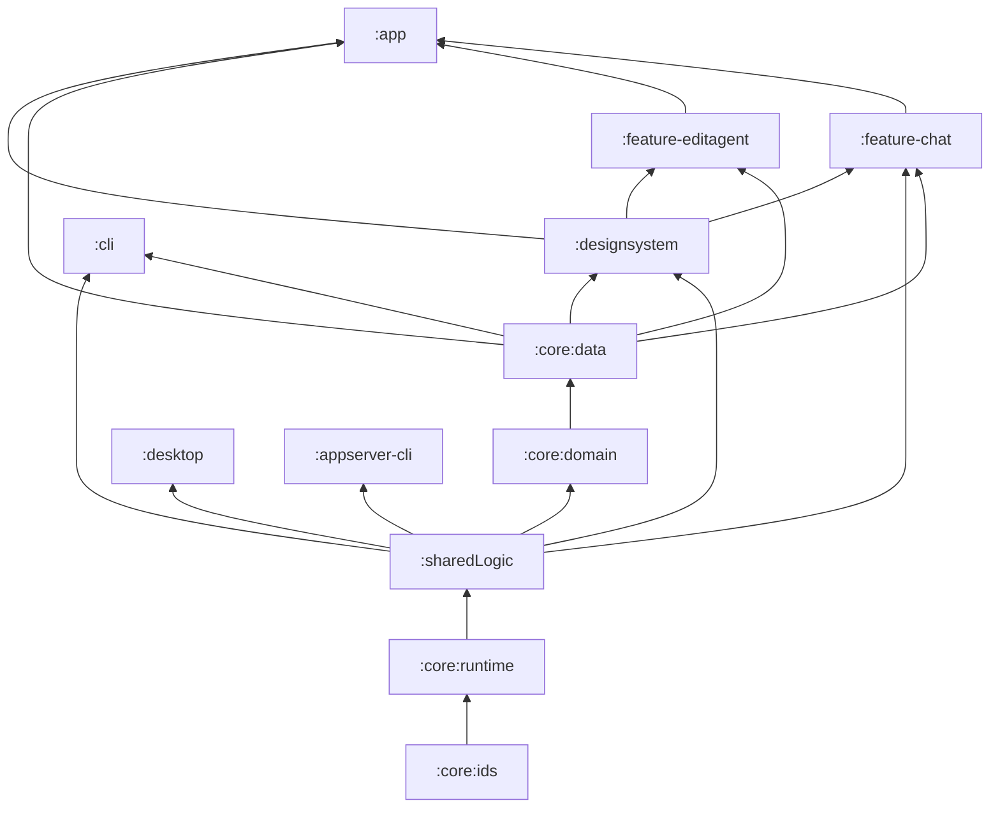
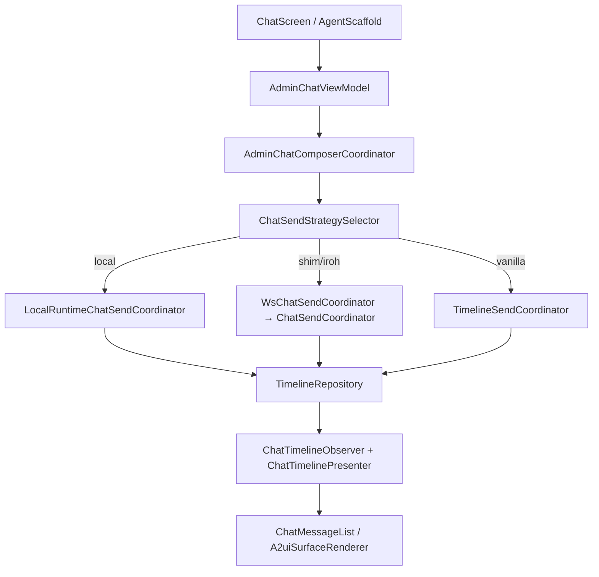
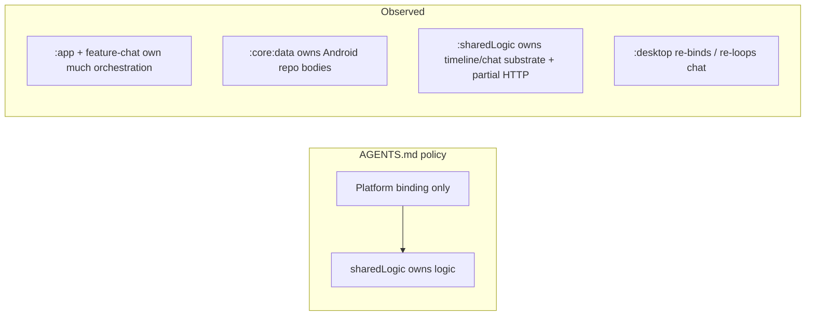

# Logical Fallacy & Boundary Audit — Master Findings

**Status:** living document  
**Created:** 2026-07-18  
**Branch / audit pass:** `cursor/architecture-fallacy-audit-4b01`  
**Scope:** architecture claims vs code reality in `android-compose/` (+ related docs)  
**Method:** evidence-first scrutiny (Gradle edges, source ownership, call paths, doc claims)

This document records contradictions, false equivalences, stale mental models, and layering inversions that make the codebase easy to reason about incorrectly. Each finding is scrutinized: **claim → evidence → verdict → risk → recommended correction**.

Use this as the working ledger when hunting architectural “logical fallacies.” Append new findings; do not delete closed ones — mark them `RESOLVED` with a date and PR.

---

## How to read this document

### Severity

| Level | Meaning |
| --- | --- |
| **P0** | Actively misleads contributors into wrong changes / dual stacks / broken host parity |
| **P1** | Structural contradiction with real drift or review cost |
| **P2** | Stale docs / naming / unused edges; low runtime risk, high confusion risk |
| **P3** | Aspirational debt; acceptable interim if labeled as such |

### Verdict vocabulary

| Verdict | Meaning |
| --- | --- |
| **CONFIRMED FALLACY** | Claim is false or misleading relative to code |
| **PARTIAL TRUTH** | Claim was once true, or true only for a subset |
| **INTENDED TENSION** | Real trade-off; not a bug, but must be named explicitly |
| **NOT A FALLACY** | Appears contradictory but is deliberate and documented correctly |
| **NEEDS MORE EVIDENCE** | Suspicious; not fully proven this pass |

### Status

`OPEN` · `DOC-FIX READY` · `CODE-FIX NEEDED` · `ACCEPTED DEBT` · `RESOLVED`

---

## Executive map (current reality)

```text
Platform hosts
  :app ───────────────┐
  :feature-chat ──────┤──► :designsystem ──► (:core:data declared; types from :sharedLogic)
  :feature-editagent ─┤
  :cli ───────────────┤──► :core:data ──► :core:domain ──► :sharedLogic
                      │                                      │
  :desktop ───────────┴──► :sharedLogic only ◄───────────────┘
                                                      │
                                         :core:runtime ◄── :core:ids
```

**Quantitative snapshot (2026-07-18):**

| Surface | Count / note |
| --- | --- |
| Gradle includes | `:app`, `:feature-chat`, `:feature-editagent`, `:designsystem`, `:sharedLogic`, `:core:{ids,runtime,domain,data,testutil}`, `:desktop`, `:cli`, `:appserver-cli`, `:avatar/*`, benchmarks |
| `:app` screen packages | **25** |
| `:app` ViewModels | **32** |
| `:feature-chat` main `.kt` files | **65** |
| `:sharedLogic` `commonMain` `.kt` | **222** |
| `:sharedLogic` `jvmAndAndroid` `.kt` | **65** |
| `:sharedLogic` `hostNativeMain` `.kt` | **5** (expect/actual stubs) |
| `I*Repository` in `sharedLogic` | **25** |
| Leftover repo APIs in `:core:domain` | **3** (+ 3 local-runtime sources) |
| `SessionScoped*` wrappers in `:core:data` | **24** |
| Shared HTTP admin impl coverage | **3** interfaces (`IAgent`, `ITool`, `ISchedule`) via `LettaHttpAdminRepositories` |
| Phantom modules in `diagrams.md` | `:feature-admin/home/settings`, `:bot`, `:plugin-api/host` |

---

## Finding index

| ID | Title | Severity | Verdict | Status |
| --- | --- | --- | --- | --- |
| F01 | Modular feature architecture | P1 | CONFIRMED FALLACY | OPEN |
| F02 | “Logic in sharedLogic, hosts only bind” | P0 | PARTIAL TRUTH | OPEN |
| F03 | Project chat = separate gateway path | P0 | CONFIRMED FALLACY | DOC-FIX READY |
| F04 | Dual chat clients / `LettaChatClient` / `:chat` | P0 | CONFIRMED FALLACY | DOC-FIX READY |
| F05 | `:designsystem` → `:core:data` dependency | P1 | CONFIRMED FALLACY | CODE-FIX NEEDED |
| F06 | Desktop shares Android chat stack | P0 | CONFIRMED FALLACY | OPEN |
| F07 | One repository implementation per contract | P0 | CONFIRMED FALLACY | OPEN |
| F08 | `sharedLogic` is platform-neutral | P1 | PARTIAL TRUTH / INTENDED TENSION | ACCEPTED DEBT |
| F09 | “`:core` is one data module” | P2 | CONFIRMED FALLACY | OPEN |
| F10 | `docs/architecture/diagrams.md` as current map | P0 | CONFIRMED FALLACY | DOC-FIX READY |
| F11 | Repository interfaces live in one place | P1 | CONFIRMED FALLACY | OPEN |
| F12 | Chat send path is a single abstraction | P1 | INTENDED TENSION | OPEN |
| F13 | A2UI is fully shared | P2 | PARTIAL TRUTH | OPEN |
| F14 | Admin/list VMs are thin UI | P1 | CONFIRMED FALLACY | OPEN |
| F15 | `coordination/` does not depend on `screen/` | P2 | CONFIRMED FALLACY | OPEN |
| F16 | README module table matches Gradle | P2 | CONFIRMED FALLACY | DOC-FIX READY |
| F17 | KMP extraction doc currency | P2 | PARTIAL TRUTH | OPEN |
| F18 | Parallel name collisions (`RunCursorStore`, RPC clients) | P2 | CONFIRMED FALLACY | OPEN |
| F19 | Plugin system / extension architecture exists | P2 | CONFIRMED FALLACY | DOC-FIX READY |
| F20 | `IrohAndroidInit` naming across targets | P3 | INTENDED TENSION | ACCEPTED DEBT |

---

## Findings (full scrutiny)

### F01 — Modular feature architecture

| Field | Detail |
| --- | --- |
| **Claim** | The app is organized as feature modules (`:feature-*`) over foundation modules. |
| **Where claimed** | `docs/architecture/diagrams.md` §§1–3; contributor mental model after seeing `:feature-chat`. |
| **Evidence** | `settings.gradle.kts` includes only `:feature-chat` and `:feature-editagent`. `:app` still owns **25** screen packages and **32** ViewModels (agents, projects, MCP, folders, tools, usage, …). |
| **Verdict** | **CONFIRMED FALLACY** (composition fallacy: two extractions ≠ modular product). |
| **Risk** | Reviewers assume new screens belong in a feature module that does not exist; logic keeps accumulating in `:app`. |
| **Correction** | Treat `:app` as the admin monolith until more features extract. Update diagrams to show “extracted: chat, edit-agent / remaining: app screens”. Track extractions explicitly. |

```text
Reality:   [app monolith] + [feature-chat] + [feature-editagent]
Diagram:   [app] → [feature-chat|admin|home|settings]  ← false
```

---

### F02 — “Logic in sharedLogic, hosts only bind”

| Field | Detail |
| --- | --- |
| **Claim** | Feature LOGIC goes in `sharedLogic/commonMain`; platform modules add only binding (AGENTS.md hard rule). |
| **Where claimed** | `AGENTS.md`, `docs/architecture/kmp-extraction-current-state.md`. |
| **Evidence** | Shared: timeline engine, `ChatSessionReducer`, `ChatSendCoordinator`, projections, many DTOs/contracts. **Not shared:** `ChatSendStrategySelector`, `TimelineSendCoordinator`, `LocalRuntimeChatSendCoordinator`, `ChatTimelineObserver`, nearly all admin ViewModel transforms (see F14), Android `AgentRepository` caching/Room/Iroh routing. Desktop re-owns chat control loop (`DesktopChatController` / `RealDesktopTimelineLoop`). |
| **Verdict** | **PARTIAL TRUTH** — the rule is real policy; compliance is uneven (chat/timeline deeper than admin). |
| **Risk** | Contributors “fix once” in the wrong layer; Android and desktop diverge silently. |
| **Correction** | Per-domain compliance matrix (below). Prefer extracting pure reducers/calculators before moving VMs wholesale. |

#### Compliance matrix (selected domains)

| Domain | Contracts in sharedLogic | Engine/impl in sharedLogic | Android host glue | Desktop glue | Compliance |
| --- | --- | --- | --- | --- | --- |
| Timeline sync | yes | yes (`TimelineRepository`, reducers) | Room/DataStore adapters, observer driver | own loop over sync primitives | **Good / split drivers** |
| Chat session FSM | yes | yes (`ChatSessionReducer`, policies) | VM + coordinators | `DesktopChatController` | **Partial** |
| Chat send | partial (`ChatSendCoordinator`) | WS path shared; timeline/local orchestration in feature-chat | 3 strategies | parallel send | **Weak** |
| Agents admin HTTP | `IAgentRepository` | `LettaHttpAdminRepositories` (desktop) | separate `AgentRepository` + Room + paging | uses shared HTTP | **Dual stack** |
| A2UI protocol | yes | `A2uiSurfaceManager` / data model | designsystem renderer | no full UI | **Partial** |
| Usage analytics | no | no | `UsageAnalyticsCalculator` in `:app` | n/a | **Violates rule** |
| Project draft validation | no | no | `ProjectHomeViewModel` | n/a | **Violates rule** |
| System access / sensors | n/a (platform) | n/a | `:app/runtime`, `:app/platform` | n/a | **Correctly platform** |

---

### F03 — Project chat = separate gateway path

| Field | Detail |
| --- | --- |
| **Claim** | When `projectIdentifier` is present, chat uses an “embedded bot gateway flow.” |
| **Where claimed** | `android-compose/README.md` (“Chat architecture boundary”). |
| **Evidence** | `ChatSendStrategySelector` branches only on `isLocalRuntime` → `isShimBackend` → else timeline. `ProjectChatCoordinator` uses `projectContext` for brief, bug reports, context-window UX and then calls the same `sendMessage` callback. Gateway send (`sendProjectMessageViaGateway`) removed (commit `1f86cd3f` per chat-boundary exploration). |
| **Verdict** | **CONFIRMED FALLACY** (stale-doc fallacy). |
| **Risk** | Engineers add project-specific transport when they should add UX-only behavior (or vice versa). |
| **Correction** | Rewrite README: project identity is a **route/UI overlay** on the unified send stack (`local` / `ws` / `timeline`). |

---

### F04 — Dual chat clients / `LettaChatClient` / `:chat`

| Field | Detail |
| --- | --- |
| **Claim** | Two chat layers: `AdminChatViewModel` (app) and `LettaChatClient` in `:chat/`. |
| **Where claimed** | `android-compose/README.md`. |
| **Evidence** | No `:chat` in `settings.gradle.kts`. No `LettaChatClient` class in tree. Production path is `:feature-chat` (`AdminChatViewModel` + coordinators). Remnant: `ChatClientVersionProvider` / `BuildConfigChatClientVersionProvider` (WS client version string only). |
| **Verdict** | **CONFIRMED FALLACY** (ghost architecture). |
| **Risk** | People search for / extend a deleted module; PRs land in the wrong place. |
| **Correction** | Delete dual-client section; document single production stack + sharedLogic primitives underneath. |

---

### F05 — `:designsystem` → `:core:data` dependency

| Field | Detail |
| --- | --- |
| **Claim** | Design system is a reusable UI foundation below features. |
| **Gradle** | `designsystem/build.gradle.kts` has `implementation(project(":core:data"))` and `implementation(project(":sharedLogic"))`. |
| **Evidence** | All `com.letta.mobile.data.*` imports in designsystem resolve to **`sharedLogic`** packages (`data.a2ui.*`, `data.model.AppTheme`, `Tool`, `LlmModel`). **Zero** imports of `:core:data`-only packages (`data.local`, `data.api`, `data.paging`, Android `util.*`). |
| **Verdict** | **CONFIRMED FALLACY** (false / cargo-cult dependency). Layering *looks* inverted; runtime coupling to Room/Hilt is not evidenced. |
| **Risk** | Circular-feeling graph; designsystem compile pulls Android data stack transitively; blocks cleaner module graphs. |
| **Correction** | Remove `:core:data` from designsystem Gradle deps; keep `:sharedLogic` only. Verify `:designsystem:compile*` / dependent tests. |

---

### F06 — Desktop shares the Android chat stack

| Field | Detail |
| --- | --- |
| **Claim** | Windows desktop runs the same chat logic via `sharedLogic`. |
| **Where claimed** | High-level KMP narrative; easy inference from module diagram. |
| **Evidence** | `:desktop` depends on `:sharedLogic` only (not `:feature-chat`, `:designsystem`, `:core:data`). Uses shared reducers/policies/gateways/`ChatTimelineProjector`, but owns `DesktopChatController` + `RealDesktopTimelineLoop`. Does **not** use `ChatTimelinePresenter`, `ChatTimelineObserver`, Android send strategies, A2UI Compose renderer, approvals/subagent rings, project chat UX. |
| **Verdict** | **CONFIRMED FALLACY** if phrased as “same stack”; **INTENDED TENSION** if phrased as “shared substrate, platform surfaces” (see `windows-chat-ui-decision.md`). |
| **Risk** | Android-only chat fixes never reach desktop; desktop “fixes” reinvent Android coordinators. |
| **Correction** | Always say **shared substrate + divergent hosts**. Maintain a parity checklist (send routes, A2UI, approvals, project overlay, local runtime). |

#### Desktop ↔ Android chat parity checklist

| Capability | Android | Desktop | Shared? |
| --- | --- | --- | --- |
| Session reducer / composer policy | yes | yes | sharedLogic |
| Timeline projection facts | presenter path | projector path | partial |
| WS send via `ChatSendCoordinator` | yes | not wired like Android | shared core unused by desktop |
| Timeline REST send | `TimelineSendCoordinator` | desktop loop | divergent |
| Local runtime send | yes | demo/local path only | divergent |
| A2UI surface UI | designsystem | missing | protocol only |
| Project chat overlay | yes | missing | Android-only |
| Approvals / subagents | yes | missing | Android-only |

---

### F07 — One repository implementation per contract

| Field | Detail |
| --- | --- |
| **Claim** | Implement platform-neutral core once; platforms inject engines only. Anti-pattern: parallel `IAgentRepository` impls (AGENTS.md; beads `mqzkc` / `8h463`). |
| **Evidence** | `LettaHttpAdminRepositories` (sharedLogic) implements `IAgentRepository` + `IToolRepository` + `IScheduleRepository` and is used by **desktop**. Android uses thick `core/data` `AgentRepository` / `ToolRepository` / `ScheduleRepository` with Room, paging, Iroh admin_rpc sources, session wrappers — **Android does not call `LettaHttpAdminRepositories`**. Remaining ~22 `I*` contracts are Android-implemented only (desktop stubs/`unavailableRepository` for many). |
| **Verdict** | **CONFIRMED FALLACY** relative to the stated end-state; current state is exactly the anti-pattern the rule warns about for agents/tools/schedules. |
| **Risk** | TTL/cache/error-flow drift between desktop HTTP admin and Android admin. |
| **Correction** | Either (a) migrate Android agent/tool/schedule reads toward shared HTTP + thin Android cache adapters, or (b) document dual stacks as transitional with an explicit ownership table and parity tests. |

#### Repository ownership table (abbrev.)

| Interface | sharedLogic HTTP/Iroh impl | Android `:core:data` impl | Desktop wiring |
| --- | --- | --- | --- |
| `IAgentRepository` | `LettaHttpAdminRepositories` | `AgentRepository` + `SessionScoped*` | shared HTTP |
| `IToolRepository` | `LettaHttpAdminRepositories` | `ToolRepository` + scoped | shared HTTP |
| `IScheduleRepository` | `LettaHttpAdminRepositories` | `ScheduleRepository` + scoped | shared HTTP |
| `ISubagentRepository` | `SubagentRepository` | `SessionScopedSubagentRepository` | via adapters |
| Chat gateway | `LettaHttpChatGateway`, `IrohAdminRpcChatGateway` | timeline/transport adapters | desktop gateways |
| Most other `I*` | contract only | full Android impl | often unavailable/stub |
| `IMessageRepository` | — (in `:core:domain`) | `MessageRepository` | — |
| `IAllConversationsRepository` | — (`:core:domain`) | Android | — |
| `ISlashCommandRepository` | — (`:core:domain`) | Android | — |

---

### F08 — `sharedLogic` is platform-neutral

| Field | Detail |
| --- | --- |
| **Claim** | `commonMain` stays platform-neutral for Android / JVM / host-native. |
| **Evidence** | `commonMain` depends on Compose Runtime; `A2uiDataModel` uses `mutableStateOf` / `State`. Broad `@Immutable` usage. Rich Compose UI + Iroh FFI live in `jvmAndAndroid` (65 files). `hostNativeMain` only supplies 5 expect/actual stubs — Native cannot take Iroh/Compose UI. |
| **Verdict** | **PARTIAL TRUTH / INTENDED TENSION**. Neutral for *logic* is aspirational; module is already a multi-layered KMP library. |
| **Risk** | Accidental JVM/Android API in `commonMain` breaks `shared-multiplatform` CI; Compose state in data layer couples UI observation to all targets. |
| **Correction** | Keep accepting `jvmAndAndroid` for UI/Iroh. Track `A2uiDataModel` Compose state as a known smell; prefer StateFlow-style seams if Native UI matters. Do not pretend the whole module is “pure Kotlin.” |

---

### F09 — “`:core` is one data module”

| Field | Detail |
| --- | --- |
| **Claim** | Older docs/CLAUDE.md speak of `core/` as a single data layer. |
| **Evidence** | Gradle modules: `:core:ids` (KMP IDs), `:core:runtime` (KMP runtime contracts), `:core:domain` (JVM leftover APIs), `:core:data` (Android binding), `:core:testutil`. |
| **Verdict** | **CONFIRMED FALLACY** if spoken as one module; fine if spoken as a **stack**. |
| **Risk** | Wrong dependency edges (`api` vs `implementation`); confusion about where new interfaces belong. |
| **Correction** | Always write `:core:data` / `:core:domain` / … explicitly. Update CLAUDE.md module table. |

---

### F10 — `docs/architecture/diagrams.md` as current map

| Field | Detail |
| --- | --- |
| **Claim** | Diagrams describe current module structure, features, plugins. |
| **Evidence** | Documents `:feature-admin`, `:feature-home`, `:feature-settings`, `:bot`, `:plugin-api`, `:plugin-host`, `:plugins-lettacode` — **none** in `settings.gradle.kts`. Some WebSocket demux diagrams may still be historically useful; module diagrams are fiction. |
| **Verdict** | **CONFIRMED FALLACY** (aspirational map presented as current). |
| **Risk** | Highest confusion amplifier for new contributors. |
| **Correction** | Banner at top: **HISTORICAL / ASPIRATIONAL — see this audit + Gradle settings for truth.** Replace §§1–5 with the executive map above, or delete phantom sections. |

---

### F11 — Repository interfaces live in one place

| Field | Detail |
| --- | --- |
| **Claim** | Shared repository contracts live in `sharedLogic`. |
| **Evidence** | 25 `I*` in `sharedLogic/.../repository/api/`. But `:core:domain` still owns `IMessageRepository`, `IAllConversationsRepository`, `ISlashCommandRepository`, plus `LocalRuntime*Source` seams — because of Paging / legacy UI models / Android coupling (`kmp-extraction-current-state.md`). |
| **Verdict** | **CONFIRMED FALLACY** as a universal claim; **PARTIAL TRUTH** historically. |
| **Risk** | Desktop/common code cannot depend on message/all-conversations contracts without pulling JVM domain. |
| **Correction** | Finish extracting paging-neutral subsets, or document the split as a hard boundary with a migration ticket. |

---

### F12 — Chat send path is a single abstraction

| Field | Detail |
| --- | --- |
| **Claim** | One chat send API / one mental model. |
| **Evidence** | `ChatSendStrategySelector` explicitly fans out to three strategies: `local`, `ws`, `timeline`. Shared `ChatSendCoordinator` only underpins the WS/shim path. Optimistic/otid/reconnect semantics differ by strategy. |
| **Verdict** | **INTENDED TENSION** (not a doc bug if named). Becomes a fallacy when people assume timeline fixes apply to WS or local. |
| **Risk** | Cross-strategy “bugfixes” that only patch one branch. |
| **Correction** | Keep strategy matrix in feature-chat README or this audit; require tests per strategy for send/cancel/404/reconnect. |

```text
select:
  isLocalRuntime → LocalRuntimeChatSendCoordinator
  isShimBackend  → WsChatSendCoordinator → shared ChatSendCoordinator
  else           → TimelineSendCoordinator → TimelineRepository.sendMessage
```

---

### F13 — A2UI is fully shared

| Field | Detail |
| --- | --- |
| **Claim** | A2UI is a shared cross-platform system. |
| **Evidence** | Protocol/state/actions in `sharedLogic`. Widget catalog + Compose renderer in `:designsystem`. Feature wiring in `:feature-chat` (`AdminChatA2uiCoordinator`). Desktop lacks the Compose catalog UI. |
| **Verdict** | **PARTIAL TRUTH** — shared protocol, Android-first presentation. |
| **Risk** | Desktop assumes A2UI “just works” because sharedLogic compiles. |
| **Correction** | Split language: “A2UI protocol (shared)” vs “A2UI renderer (Android designsystem).” |

---

### F14 — Admin/list ViewModels are thin UI

| Field | Detail |
| --- | --- |
| **Claim** | ViewModels are UI adapters; domain logic is shared. |
| **Evidence** | Shareable pure logic still in `:app`, including: `UsageAnalyticsCalculator`, `DashboardUsageAnalytics`, project draft validation in `ProjectHomeViewModel`, issue analytics in `ProjectIssuesViewModel`, agent create/import shaping in `AgentListViewModel`, conversation pin/sort mapping, config mode/local-model normalization. |
| **Verdict** | **CONFIRMED FALLACY** for those surfaces. |
| **Risk** | Desktop/admin CLI cannot reuse analytics/validation; duplication or behavior drift. |
| **Correction** | Extract calculators/validators into `sharedLogic` with commonTest fixtures; leave Android VM as binder. |

#### Candidate extraction list (from this pass)

1. `UsageAnalyticsCalculator` / dashboard usage analytics  
2. Project draft validation rules  
3. Project issue filter/sort/date bucketing  
4. Agent create/import request shaping + readiness matrix  
5. Conversation display sort/pin rules  
6. Config mode mapping + local-model normalization  

---

### F15 — `coordination/` does not depend on `screen/`

| Field | Detail |
| --- | --- |
| **Claim** | Clean package layering inside `:feature-chat` (coordinators below VM/UI). |
| **Evidence** | `ChatTimelineObserver`, `ChatSearchCoordinator`, `ChatRunExpansionState` import `AdminChatViewModel` from `screen/`. |
| **Verdict** | **CONFIRMED FALLACY** (within-module inversion). |
| **Risk** | Harder extraction of coordinators into sharedLogic; cyclic mental model. |
| **Correction** | Move shared nested types/constants out of the ViewModel file; coordinators should depend on interfaces/state types only. |

---

### F16 — README module table matches Gradle

| Field | Detail |
| --- | --- |
| **Claim** | README “Modules” table describes the project. |
| **Evidence** | Table lists `app`, `core`, `designsystem`, `chat` — misses `sharedLogic`, `feature-*`, `desktop`, `core:*` split; invents `chat`. |
| **Verdict** | **CONFIRMED FALLACY**. |
| **Correction** | Replace table with Gradle-accurate module list + one-line purposes. |

---

### F17 — KMP extraction doc currency

| Field | Detail |
| --- | --- |
| **Claim** | `kmp-extraction-current-state.md` (dated 2026-06-06) is the extraction source of truth. |
| **Evidence** | Still directionally useful (landed vs stubbed vs gaps). Some rows lag (desktop chat progress, chat module deletion, shared HTTP admin existence). |
| **Verdict** | **PARTIAL TRUTH** — keep, but stamp “verify against this audit.” |
| **Correction** | Add “Last verified” line; link here; refresh desktop/repo rows. |

---

### F18 — Parallel name collisions

| Field | Detail |
| --- | --- |
| **Claim** | Shared names mean shared types. |
| **Evidence** | `RunCursorStore`: interface in `sharedLogic/.../transport/`, Android DataStore class in `core/data/.../transport/` (same simple name / package family). `IrohAdminRpcClient`: distinct helpers in `core/data` vs `sharedLogic` transport/appserver. `DomainIdConverters.kt` filename reused for Room vs A2UI. |
| **Verdict** | **CONFIRMED FALLACY** for name→identity inference. |
| **Risk** | Wrong import / wrong mental model during refactors. |
| **Correction** | Prefer suffixing Android adapters (`AndroidRunCursorStore`) when touching these files. |

---

### F19 — Plugin system / extension architecture exists

| Field | Detail |
| --- | --- |
| **Claim** | Plugin API/host/extensions power navigation/theme/events (`diagrams.md` §§4–5). |
| **Evidence** | No plugin modules in Gradle. Navigation is `AppNavGraph` + feature graphs inside the app binary. |
| **Verdict** | **CONFIRMED FALLACY**. |
| **Correction** | Relabel diagrams as future proposal or delete. Do not plan work against plugin modules until they exist. |

---

### F20 — `IrohAndroidInit` naming across targets

| Field | Detail |
| --- | --- |
| **Claim** | Name implies Android-only API. |
| **Evidence** | `expect` in commonMain; Android installs JNI context; JVM/native actuals are no-ops. |
| **Verdict** | **INTENDED TENSION** (works; naming tax). |
| **Correction** | Optional rename to `IrohPlatformInit` when next touched. |

---

## Cross-cutting fallacy patterns

These recur across findings — useful when reviewing new PRs:

1. **Aspirational docs as present tense** — F03, F04, F10, F16, F19  
2. **Interface sharing mistaken for implementation sharing** — F02, F07, F11  
3. **Composition fallacy (“we have feature modules”)** — F01  
4. **False host equivalence (Android ≡ Desktop)** — F06, F13  
5. **Ghost modules / deleted paths still taught** — F04, F19  
6. **Gradle edges that don’t match import graph** — F05  
7. **Name collision → identity** — F18  
8. **Strategy fan-out ignored** — F12  

---

## Truthful architecture diagrams (replace phantoms)

### Module dependency (actual)



### Android chat send (actual)



### Intended vs actual ownership



---

## Recommended remediation sequence

Ordered for leverage vs blast radius (not calendar estimates):

1. **Doc hygiene (P0, low risk)** — Fix `android-compose/README.md` chat section; banner/rewrite `diagrams.md`; fix CLAUDE.md/`README` module tables (F03, F04, F10, F16, F19).  
2. **Drop false Gradle edge** — Remove `:core:data` from `:designsystem` (F05).  
3. **Name the dual repo stacks** — Ownership table in `kmp-extraction-current-state.md` + decide migrate-vs-accept for agents/tools/schedules (F07).  
4. **Desktop/Android chat parity checklist** — Make F06 checklist a required review artifact for chat PRs.  
5. **Extract pure calculators from `:app`** — F14 list into `sharedLogic` + commonTest.  
6. **Break `coordination` → `screen` imports** — F15.  
7. **Converge send orchestration** — Only after parity tests exist (F12 / F06).  

---

## Scrutiny log (append-only)

| Date | Pass | What was scrutinized | Result |
| --- | --- | --- | --- |
| 2026-07-18 | Initial master pass | F01–F20; Gradle settings; README; diagrams; chat send selector; designsystem imports; repo dual stack; desktop chat controller; sharedLogic source-set counts | All indexed findings opened with evidence |
| | | | |

### Pass notes — 2026-07-18

- Confirmed README still teaches deleted `:chat` / `LettaChatClient` and project gateway branching.  
- Confirmed `ChatSendStrategySelector` has no project-gateway branch.  
- Confirmed designsystem’s `:core:data` dependency appears unused by imports.  
- Confirmed Android never references `LettaHttpAdminRepositories` (desktop-only consumer).  
- Confirmed `diagrams.md` phantom feature/plugin modules.  
- `bd` CLI was unavailable in the audit environment; tracking via this document + PR until beads can be synced.

---

## Open questions / needs more evidence

| QID | Question | Why it matters |
| --- | --- | --- |
| Q1 | Do any designsystem **transitive** consumers require `:core:data` via designsystem’s Gradle edge? | Blocks safe removal in F05 |
| Q2 | Is there an active plan/bead to migrate Android `AgentRepository` onto `LettaHttpAdminRepositories`? | Determines F07 remediation path |
| Q3 | Which desktop admin surfaces are intentionally stubbed vs incomplete? | Avoid false “desktop parity” bugs |
| Q4 | Should `A2uiDataModel` Compose state move off `commonMain` before iOS targets? | F08 endgame |
| Q5 | Are WebSocket demux diagrams in `diagrams.md` §§7–10 still accurate to `WsChatBridge`? | Not fully re-validated this pass (`NEEDS MORE EVIDENCE`) |

---

## Related documents

| Doc | Relationship |
| --- | --- |
| [`diagrams.md`](./diagrams.md) | Partially obsolete; superseded for module topology by this audit |
| [`kmp-extraction-current-state.md`](./kmp-extraction-current-state.md) | Policy + extraction ledger; verify rows against F02/F07/F11 |
| [`windows-chat-ui-decision.md`](./windows-chat-ui-decision.md) | Intentional desktop UI divergence (supports F06 “intended tension” framing) |
| [`chat-boundary-regression-harness.md`](./chat-boundary-regression-harness.md) | Chat boundary testing — update if README chat section changes |
| `android-compose/README.md` | Contains F03/F04/F16 doc bugs |
| `AGENTS.md` | States the sharing rule that F02/F07 measure compliance against |

---

## Template for new findings

Copy when appending:

```markdown
### Fxx — short title

| Field | Detail |
| --- | --- |
| **Claim** | |
| **Where claimed** | |
| **Evidence** | paths, counts, commands |
| **Verdict** | CONFIRMED FALLACY / PARTIAL TRUTH / INTENDED TENSION / NOT A FALLACY / NEEDS MORE EVIDENCE |
| **Risk** | |
| **Correction** | |
| **Status** | OPEN |
```
